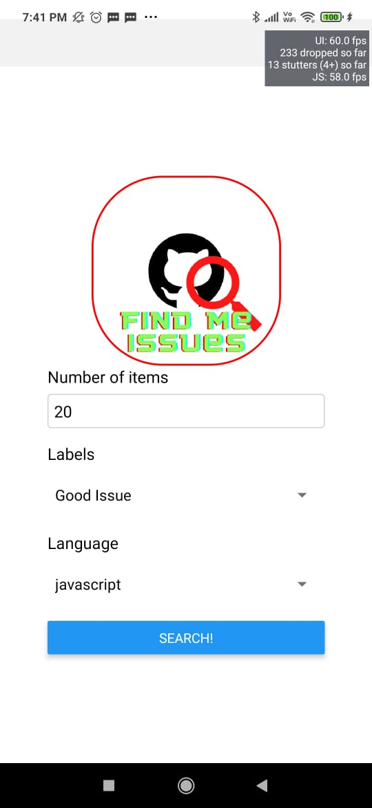
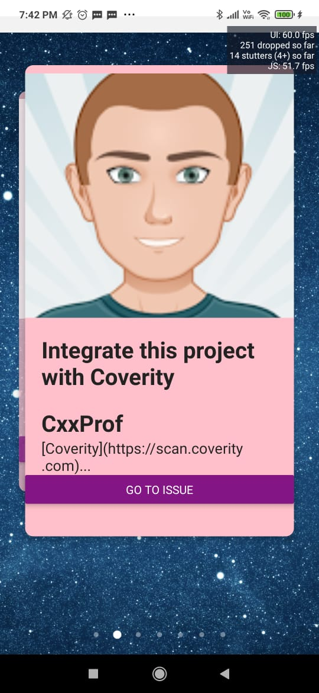

# <p align="center"> Find Me Issues-APP Version! </p>

# <p align="center"></p>

# <h1 align="center">Find-Me-Issues </h1>

A React Native based android/iOS app to find repositories containing 'good first issues' open source contribution. Any kind of contribution and suggestions are highly appreciated!

### <p align="center">Don't Just Fork The Project, if you like it please consider staring it!<p align="center">

## <p align="center"> Stack:</p>


<p align="center"> </p>

## About The Project:
<p align="center">
You know what is one of most painful thing for programmers new to open-source? Finding beginner friendly projects to contribute to!
After a good start of my web-app find me issues, I present you the native version which can run right on your fingers!
</p>

<p align="center">
Weirdly enough sometimes I am on the move or not in front of my laptop, I still wanna book mark some good issues to work on when I get a change to do so. Well, here is my solution for anyone facing a similar problem!
</p>

<p align="center">
Currently only in beta stage, the app allows you to filter repositories on basis of language and issue labels, which you can enter in the front page!
</p>

## Screenshots of the App:

<p align="center"></p>
<br>
<p align="center"></p>
<br>
<p align="center"></p>

<p align="center">
Any and all kinds of suggestions are highly welcome! There is a plan for this application to go live on APP store soon after addition of a couple of new features! That's where you come in!
</p>


## Ffr contribution:


- Clone the repository in your local enviorment
    <br>
    ```console
        foo@bar:~$ git clone https://github.com/version0chiro/find-me-issues-app.git
    ```
- run npm/yarn install on the directory 
  - start the react native development
    <br>
    ```console
        foo@bar:~$ cd find-me-issues-app
        foo@bar:~$ npm start
    ```

    This will make a new window open on your webbrower which will be the expo client! Now run the react-native app on your device any other kind of simulator! 
    

  